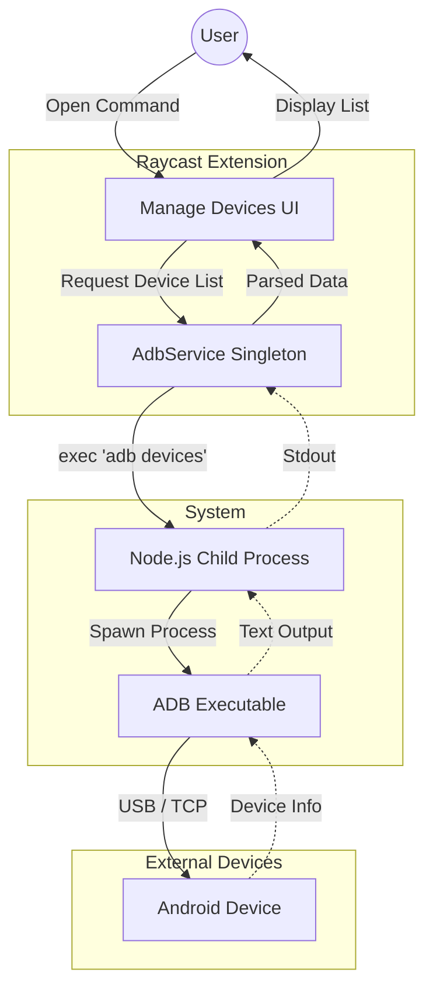

# ADB Pro - Project Documentation

## Project Overview
**ADB Pro** is a comprehensive Raycast extension designed to simplify Android development workflows. It bridges the gap between the macOS/Windows environment and Android devices by providing a GUI for common ADB (Android Debug Bridge) commands directly within Raycast.

## Raycast Commands
The project exposes the following main command to the Raycast ecosystem:

### 1. Manage Devices (`manage-devices`)
*   **Description**: The central hub for all interaction. It lists all connected Android devices (USB & Wireless).
*   **Entry Point**: `src/manage-devices.tsx`
*   **Functionality**:
    *   Auto-detects `adb` path.
    *   Lists devices with status (device, offline, etc.).
    *   Provides access to device-specific actions (Apps, Controls, Tools).

---

## Internal Features & Capabilities
These features are implemented in the `AdbService` and are accessible via the UI for selected devices.

### Device Management
*   **Connect/Disconnect**: Connect to devices over TCP/IP (Wireless Debugging).
*   **Reboot**: Restart the device into System, Bootloader, or Recovery mode.

### App Management
*   **List Apps**: Fetch list of installed third-party or system packages.
*   **Uninstall**: Remove applications from the device.
*   **Force Stop**: Kill a running application.
*   **Clear Data**: Reset an application's data.

### Device Controls
*   **WiFi Toggle**: Enable or disable WiFi connectivity.
*   **Mobile Data Toggle**: Enable or disable Mobile Data.
*   **Input Text**: Type text directly onto the device clipboard/input field from Raycast.

### External Tools Integration
*   **Scrcpy**: Launch screen mirroring for the device (requires `scrcpy` installed).
*   **Logcat**: View the last 500 lines of device logs directly in Raycast.

---

## Technical Architecture

### High-Level Components
1.  **Presentation Layer (UI)**: Built with React and `@raycast/api`. Handles user input, state management, and rendering lists/forms.
2.  **Service Layer (`AdbService`)**: Singleton class acting as the middleman. It abstracts all interactions with `child_process` and manages the `adb` executable path.
3.  **Infrastructure**: Uses Node.js `exec` calls to run shell commands.

### Architecture Diagram

### Data Flow Example
1.  **User** opens "Manage Devices".
2.  `manage-devices.tsx` calls `adbService.getDevices()`.
3.  `adbService` executes `adb devices -l` using `child_process`.
4.  Standard output is parsed by strict string manipulation to extract Model, Product, and ID.
5.  Data is returned as structured `Device[]` objects to the React component.
6.  Component renders the Raycast `List` view.

## Source Code Structure
*   `src/manage-devices.tsx`: Main command entry point.
*   `src/services/adb.ts`: Core logic for all ADB operations.
*   `src/components/`: Reusable UI components (DeviceList, SetupGuide).
*   `src/types/`: TypeScript definitions for Devices, Apps, and Errors.
*   `src/utils/`: Helper functions for parsing output.
